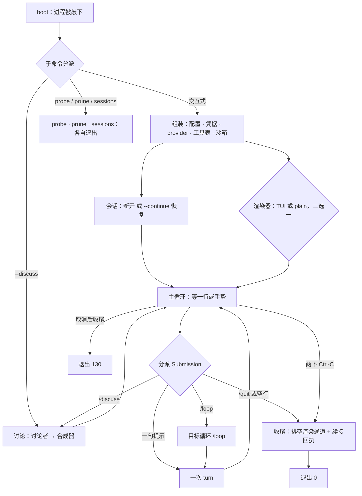
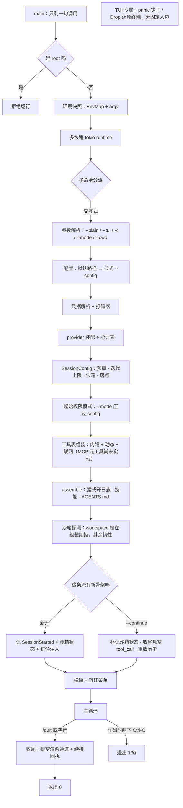
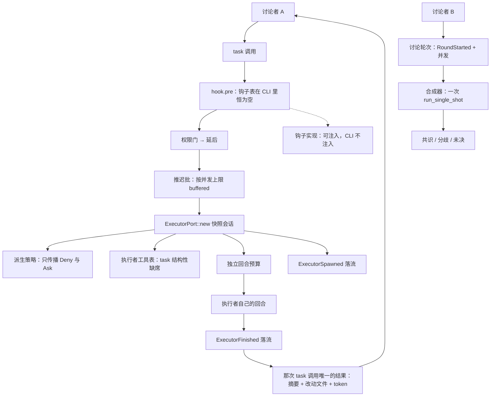
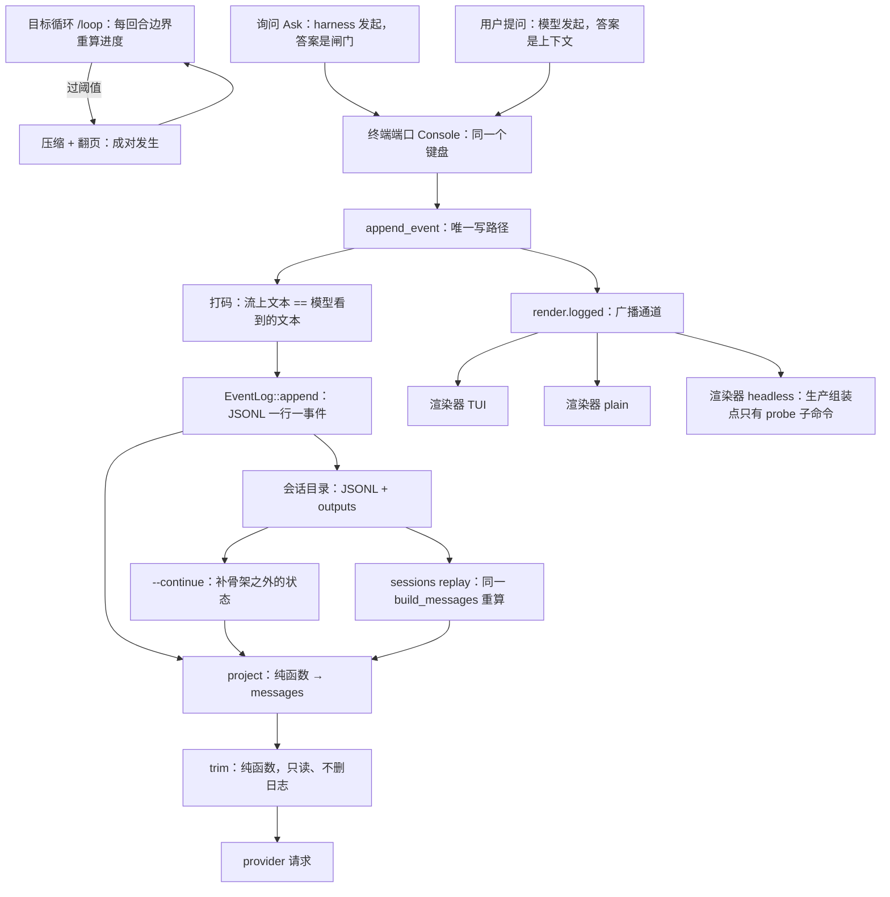

# 五张生命周期图：草稿 v2（票 04 取证后修正）

> 票 01 的产物，票 04 逐节点取证后修正。**这不是 `docs/lifecycle.md`** —— 它是那张文档的图源。
> 事实基线： [`../research/01-runtime-lifecycle-facts.md`](../research/01-runtime-lifecycle-facts.md)（侦察）
> 与 [`../research/04-node-evidence.md`](../research/04-node-evidence.md)（逐节点证据，343 行）。
> 八处修正与五处裁决见末尾。
>
> 节点一律用 `CONTEXT.md` 的正式用词：事件流 · 投影 · 讨论者 · 执行者 · 合成器 · 询问 · 用户提问 ·
> 翻页 · 落点 · 渲染器 · 终端端口 · 沙箱 · 打码 · 回合 · 轮次 · 目标。

---

## 图 1：鸟瞰总图（`flowchart TD`）



**自评（三条）**

1. **`maint` 已改成「各自退出」**（票 04 §8·4）：三条子命令各自 `return` 自己的 `ExitCode`
   （`src/cli.rs:115-124`），既不组装会话、也不走 `interactive` 的 `shutdown → finish_session`。
2. **`goal --> turn` 成立，原稿的怀疑被取证否掉**：`run_goal_loop` 在 `src/cli.rs:1626` 用
   `TurnStart::Injected` 驱动每次 `run_one_turn`。但边标签应写「每回合边界」而不是「进入 turn」。
3. **`render` 是同一层的东西被画成了先后**：渲染器在 `assemble` 里起（`src/lib.rs:217-275`），与
   `sess` 是兄弟、不是父子。这是**有意的简化**（总图要压得住），图 2 展开它。

---

## 图 2：进程启动与收尾（`flowchart TD`）



**自评（三条）**

1. **探测的顺序原来是错的**（票 04 §8·1）：组装期显式的沙箱检查只有 `workspace` 档那一条
   （`src/lib.rs:457`），非 `workspace` 档直接早退、不探；真正的探测在 `open` **之后**的
   `session()` 里惰性做（`src/lib.rs:460 → :279 → :315-322`）。已改成 `tools → open → probe`。
2. **`panic` 没有可指认的入边**（票 04 §8·2）：钩子只在 TUI 的 `TerminalModes::enter` 装一次
   （`src/render/tui.rs:537`），`Drop` 也只挂在它上面（`:559-563`）；plain / headless 不装。所以它
   画成**无入边的 TUI 专属节点**，而不是从主循环出来的一条边。
3. **`refuse` 的断头是对的**（`src/cli.rs:83-86`：root 直接拒、无旗标可绕）。留一个没有出边的节点
   会像漏画 —— 这是**有意**的，别在定稿时给它补一条假边。

---

## 图 3：一次 turn（`sequenceDiagram`）

```mermaid
sequenceDiagram
    participant human as 人
    participant loop as 循环
    participant prov as provider
    participant gate as 权限门（authorize）
    participant tools as 工具表

    human->>loop: 一句提示
    loop->>loop: cancel.reset()（手势范围限一次运行）
    loop->>loop: 还有挂着的 tool_call？→ 直接 TurnEnded
    loop->>loop: 预算 / 迭代上限 / 取消 三处预检
    loop->>loop: TurnStarted 落流
    loop->>loop: 组装 messages：project → 私有身份 → trim
    loop->>loop: 估预算预检（明显装不下就不发）
    loop->>prov: ChatRequest（tools 表原样）
    prov-->>loop: 增量文本（走渲染通道，不进流）
    prov-->>loop: UsageRecorded 落流
    prov-->>loop: [DONE]
    loop->>loop: MessageCompleted 落流
    Note over loop: 固定顺序是 hook.pre → 门 → [询问] → dispatch → hook.post → 追加；其中两个 hook 步骤在 CLI 里恒不发生（表是 None）
    loop->>gate: 权限门 + 钩子约束取上确界
    gate->>human: Ask 时问一次
    human-->>gate: 允许 / 总是允许 / 拒绝
    gate-->>loop: 裁决
    loop->>tools: dispatch（工作区锁 → 路径锁）
    tools-->>loop: 结果：打码 → 截断 → 追加
    loop->>loop: 还有 tool_call？→ 下一轮迭代
    loop-->>human: TurnEnded
```

**自评（三条）**

1. **消息方向已修正，hook 的两行降级成一条 `Note`**（票 04 §8·7、票 02）：门由**循环**在
   `process_call` 里调（`src/agent.rs:998-1007`），工具表只在门之后被调（`:1081-1097`）—— 原来写成
   `tools->>gate` 是反的；而 `hook.pre` / `hook.post` 在 CLI 下**恒不发生**（三个生产组装点全传
   `None`），占两行消息会把「可注入但没人插」画成常规步骤，所以改成 Note。
2. **`gate` 是一个抽象参与者**（票 04 §8·6）：没有对象持有「询问 → 人答」这次往返，证据只能落到
   `authorize`（`src/agent.rs:1954-1995`）与 `ConsoleAsker`（`src/render/input.rs:251`）。
3. **守卫被画成了常规路径**：「还有挂着的 `tool_call` 就绝不调 provider」是真的（不变量 2，
   `src/agent.rs:478-480`），但几乎从不触发 —— 定稿时值得在文档正文里加一句「这是守卫、不是步骤」。

> **落地时的一处偏离（2026-10-03）**：`participant loop` 撞上 `sequenceDiagram` 的保留字 `loop`，
> mermaid 直接报 `Parse error on line 8 … got 'loop'`。`docs/lifecycle.md` 里这个参与者改名成
> **`core`**（标签仍是「循环」），**其余逐字一致** —— 照这份图源重画时请一并改名。

---

## 图 4：委派与嵌套（`flowchart TD`）



**自评（三条）**

1. **`policy` / `table` / `budget` 已改成三条并列派生**（原稿画成 `policy → table → budget` 一条链，
   会读成有先后依赖）：三者各自从父会话快照派生（`src/agent/executor.rs:107-134`）。
2. **并发画不出来。** 两个讨论者是**并发**跑各自的回合、往**同一条流**上写，靠 `seq` 切窗而不是时序
   （`src/agent.rs:1334-1427`）；执行者的推迟批同理。这一条已裁决为「图只表达存在、不表达并发」。
3. **合成器不是第三种 agent**：它没有工具、没有回合、不参与轮次（`CONTEXT.md:36-38`）。用一个节点画
   它可能被读成「第三种 agent」—— 定稿时可考虑给它一个不同的形状。

---

## 图 5：基础设施回路（`flowchart TD`）



**自评（三条）**

1. **`headless` 已从虚线改成实线，并且这是本轮的**重要修正**（票 04 §7·1）：侦察报告说「`cli.rs`
   从不构造它」是**错的** —— `probe` 子命令经 `probe_model` 在 `src/cli.rs:2238` 真的构造
   `Renderer::headless`，而那段在 `#[cfg(test)]`（`:3312` 起）**之外**。虚线因此只剩图 4 那条。
2. **`roll` 节点已删**（票 04 §8·5）：阈值判定不是一个可指认的跨阶段节点，它是
   `goals::threshold_step`（`src/goals.rs:629-640`）在目标循环里的一步（`src/cli.rs:1711-1716`），
   现在表达成边标签「过阈值」。
3. **两条回路仍然容易混**：「事件流 → 投影 → 裁剪 → 请求」是**每回合**回路，`goal ↔ compact` 是
   **跨会话**回路（过阈值才走）。定稿时建议在文档里把它们分成两节讲。

---

## 票 04 取证后的九处修正（2026-10-03）

| # | 原稿 | 修正 | 依据 |
| --- | --- | --- | --- |
| 1 | 图 2 `tools → probe → open` | 改成 `tools → open → probe` —— 探测在 `open` 之后的 `session()` 里惰性做 | `src/lib.rs:457`、`:459-460`、`:279`、`:315-322` |
| 2 | 图 2 `loop -->\|panic\| panic` | 删这条边；`panic` 改成无入边的 TUI 专属节点 | `src/render/tui.rs:537`、`:559-563`、`:471` |
| 3 | 图 1 `render{TUI / plain / headless}` | 改成「TUI 或 plain，二选一」—— 交互式路径只二选一 | `src/cli.rs:328-372` |
| 4 | 图 1 `maint --> ok` | 删这条边；`maint` 改注「各自退出」 | `src/cli.rs:115-124` |
| 5 | 图 5 `roll{过 compact_at 了吗}` | 删节点；改成边 `goal -->\|过阈值\| compact` | `src/goals.rs:629-640`、`src/cli.rs:1711-1716` |
| 6 | 图 3 `participant gate as 权限门` | 标注 `（authorize）`，说明它是抽象、没有持有往返的对象 | `src/agent.rs:1954-1995`、`src/render/input.rs:251` |
| 7 | 图 3 `tools->>gate` | 改成 `loop->>gate` + `gate-->>loop: 裁决`，派发改由循环调 | `src/agent.rs:998-1007`、`:1081-1097` |
| 8 | 图 5 `rlog -.-> headless` | 改实线；`headless` 标注「生产组装点只有 `probe`」 | `src/cli.rs:2150`、`:2238` |
| 9 | 图 4 `policy → table → budget` 一条链 | 拆成 `spawn → policy/table/budget` 三条并列 | `src/agent/executor.rs:107-134` |

另外两条**不是图的错、是检查器的错**（第 10 条见下）。

---

## 五处冲突的裁决（票 01 与票 04 之后）

1. **虚线语法** → 票 03 的白名单**扩认 `-.->`**（虚线只表示「可注入但 CLI 不注入」与「尚未实现」）。
2. **`sequenceDiagram`** → **不进 C4/C5 对账**，只有四张 `flowchart` 参与「表与图的节点集合相等」，
   图 3 靠人读。
3. **并发** → **不做画法约定**，图只表达「存在」；并发事实用边标签或文档正文一句话交代。
4. **虚线语义** → **写死为「可注入但 CLI 不注入」+「尚未实现」**；异常路径（两下 `Ctrl-C`、panic）
   改用边标签。
5. **节点 id 的命名空间**（票 04 §8·8）→ **C4/C5 按图分别比对**：每张图自己的节点集合 == **它自己
   那一节**证据表的键集合，不要求跨图唯一。跨图撞名的有 `cmd` / `loop` / `ok` / `gate` / `red` /
   `goal`；逼它们全局唯一只会长出 `g1_boot` 这种噪音前缀。这是对票 03 的**第三处**修订。
