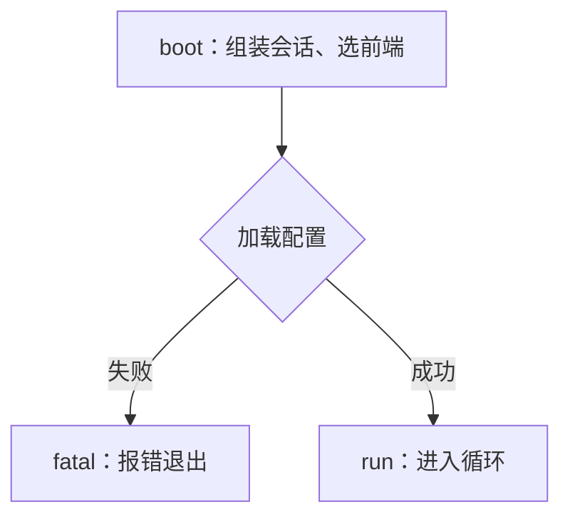

# `scripts/lifecycle-check.py` 设计调研：图与它的证据表怎么对账

这份报告回答 effort 拍下的那个问题：给 [`docs/lifecycle.md`](../../../docs/lifecycle.md) 的
mermaid 生命周期图配一份「节点/边 → `文件:行号`」证据表，再用脚本防止图与代码脱节 ——
脚本该校验什么、怎么校验、会有什么误报。**本文只给设计，不写实现。**

三个影响全篇的前提：

1. **`docs/lifecycle.md` 还不存在**，脚本要盯的第一份文档是**新写的**，作者可以按检查器的
   方言去写它。这与 `wayfinder-check.py` 面对的老图处境相反（那边要迁就既成事实，见
   `scripts/wayfinder-check.py:79-82`）。
2. **全仓目前一个 mermaid 代码块都没有。** 唯一出现是 `docs/adr/0008-markdown-parsing-by-pulldown-cmark.md:24`
   在说某个 crate 的体积（「7.27 MB 是一个 mermaid 动图」），与语法无关。没有既成方言要
   兼容，脚本可以自己圈一个**受约束子集**（§2）。
3. **没有 CI，没有 Makefile**（两者都不存在），护栏靠 `README.md:257-262` 的「开发」一节
   列出来、由人或 skill 手工调用。所以**输出文本就是接口**，退出码是唯一机器信号。

## 0. 定位：守什么、不守什么

`wayfinder-check.py:4-9` 把自己定位成「原生 tracker 本来会做的那次『期望 vs 实际』比对」，
不是正确性证明。lifecycle-check 沿用同一定位，把边界写进 docstring：

- **守得住**：指称完整性 —— 图里每个节点在表里有且仅有一行，每条证据仍指得到文件、行号不
  越界、点名的符号仍在；图自身结构自洽（id 唯一、边端点有定义）。
- **守不住**：语义正确性 —— 脚本不知道 `boot → load_config` 这条边对不对，只知道它两端都
  有人认领。**通过 ≠ 图是对的**，这句要进 docstring，否则护栏会被当成事实来源。
- **绝不改文件**：与 `wayfinder-check.py` 一致，只读、只打印、只用退出码表态。

## 1. 可校验项清单

「严/松」是 §3 的落点：**严** = 计失败、退出 1；**松** = 只告警、退出仍 0。

| # | 校验什么 | 严/松 | 误报风险 |
|---|---|---|---|
| C1 | 每条 `路径:行号` 的文件存在、行数够 | 严 | 低（路径搬家、区间写反） |
| C2 | 点名的符号仍在该文件里 | 严 | 中（同名符号、`impl` 书写形态） |
| C3 | `docs/lifecycle.md` 仍被 `README.md` 引用 | 严 | 低（链接写法漂移） |
| C4 | 证据表节点键集合 == 图的节点集合 | 严 | 中（解析漏节点 → 假差异） |
| C5 | 反向：图里每个节点都有表行 | 严 | 同 C4（同一次比对的两个方向） |
| C6 | mermaid 自检：节点 id 不重复定义 | 严 | 低 |
| C7 | mermaid 自检：每条边两端都已显式定义 | 严 | 中（mermaid 本来允许隐式定义） |
| C8 | 图只用约定方言与命名，否则「无法判定」 | 严 | 低（要求作者迁就检查器） |
| C9 | 行号仍精确（符号落在该行） | **松** | 高（任何插入都会动行号） |
| C10 | `docs/lifecycle.md` 已进 `check-language.py` 的清单 | 不做 | —（越界，见下） |

**C1 文件存在、行数够。** 校验路径能落到普通文件、`行数 ≥ 行号`（区间 `路径:a-b` 则
`b ≥ a` 且 `行数 ≥ b`）。仓库里 `路径:行号` 已是既成写法，共 837 处、含区间形态 ——
`.scratch/grep-tool/research/01-search-tool-implementation.md:52-62` 整张表都是
`src/tools/file.rs:130-131` 这种。一条正则 `((?:[\w./-]+):(\d+)(?:-(\d+))?)` 吃下两种形态，
再 `os.path.isfile` + 数行。误报低：文件改名会真报（正是要守的），区间写反也真报。

**C2 符号仍在文件里。** 建议证据表把符号单独成列，别塞进自由文本：

```markdown
## 节点证据

| 节点 | 说明 | 证据 | 符号 |
| --- | --- | --- | --- |
| `boot` | 组装会话、选前端 | `src/cli.rs:120` | `fn run` |
| `append_event` | 追加一条事件 | `src/events.rs:88` | `fn append` |
```

符号语法用「关键词 + 名字」两段，只支持稳定的那批：`fn`/`struct`/`enum`/`trait`/`const`/
`static`/`mod`/`type`/`union`。匹配对着**文件全文**按词边界找（
`\b(?:pub(?:\([^)]*\))?\s+)?(?:async\s+)?fn\s+run\b`），别搜裸名字 —— 裸名字会被注释、
字符串与局部变量骗到。误报中，三个已知坑：① `impl` 的「名字」是 `Trait for Type`，写法
不统一，建议 v1 **不许用 `impl` 当证据符号**，改用其中的方法；② `macro_rules!` 语法特殊，
v1 不支持；③ 同文件同名函数（不同 `impl` 块）会让存在性检查假绿 —— 这是漏报，接受。

**C3 文档仍被 `README.md` 引用。** 在 `README.md` 全文找 `docs/lifecycle\.md` 即可，
**不要**去认特定小节：入口有两处都可能 —— `README.md:234-244` 的「文档」表（逐面文档列在
`README.md:240`），以及 `README.md:219-231` 的「架构」节（生命周期讲的就是架构，很可能在
那里被引）。`AGENTS.md:23` 把约定写死了：「每一份文档都只有一处索引：`README.md` 的
**「文档」一节**」；两处任一命中即通过。误报低；省略扩展名写成 `docs/lifecycle` 会误报，
但那种写法本就该改回完整相对链接（`.scratch/docs-tidy/spec.md:52` 记过全仓扫链接的做法）。

**C4 / C5 表与图的节点集合一致。** 两侧各出一个 `set[str]`，然后看
`graph_nodes ^ table_nodes`，按方向分别打印「图里有、表里没有」与「表里有、图里没有」。
这是一个等式而非两个包含关系，所以 C4、C5 是同一次比对的两个方向。误报中 —— **全部来自
解析漏节点**：任何 mermaid 语法没被认出来，都会表现为「图里有、表里没有」的假差异。C8 就是
为它准备的（不认识的构造显式报红，而不是静默丢掉节点）。

**C6 / C7 mermaid 自检。** C6：每个 id 只被**显式定义**一次；mermaid 本身允许同 id 重复
定义（以后一次为准），文档里应禁止 —— 重复通常是复制粘贴事故。C7 需要先立一条写作约定：
**mermaid 的 `A --> B` 会隐式定义 B**（B 没写标签就以 id 当标签），所以「指向不存在的节点」
在原生语义下几乎不存在，自检要成立必须先约定「每个节点先用形状语法显式定义一次」
（`boot[启动]`、`check{判断}`），边只引用已定义的 id。否则这条检查形同虚设。误报低：对一份
新文档，要求作者改文档而不是改检查器，是可接受的。

**C8 方言与命名白名单。** 解析器**只认**它认识的语句形态，其余构造收进
`problems.append(f"第 N 行：不认识的 mermaid 构造 …")` 计失败。节点 id 建议限
`[a-z][a-z0-9_]*`，避开 `end`/`graph`/`click` 这类关键字与大小写歧义。误报低；代价是作者
不能用 subgraph、`&` 多节点、`classDef` —— 对一张生命周期图，这不是损失。

**C9 行号仍精确（松）。** C2 已拿到符号的**真实行号**：相等则静默；不等则打印
`提示：src/x.rs:120 的 fn run 现在在 137 行`，退出仍 0；`--strict` 时计失败。误报高 ——
这是全篇唯一系统性易漂的项（§3）。

**C10 不做：与 `check-language.py` 联动。** `check_docs()` 只遍历 `DOCS_MIN_RATIO` 的键
（`scripts/check-language.py:345-355`），**不扫描 `docs/*.md`** —— 新文档不登记就完全不受
中文占比护栏，`docs/lifecycle.md` 现在当然不在清单里（`scripts/check-language.py:151-180`）。
让 lifecycle-check 顺手断言「它登记了」，技术上可行但**越界**：两个脚本会互相知道对方的内部
结构。正确做法是落地文档时同一次提交里补 `DOCS_MIN_RATIO` 一行（照
`scripts/check-language.py:160-161` 那种「实测值」注释）。这条缺口记在这里，不进脚本。

## 2. 从 mermaid 提取节点 id：可行方案与它的天花板

### 建议的图方言

先立约，再解析。建议 lifecycle.md 只用这一种子集（写进文档开头，也写进脚本 docstring）：

````markdown

````

允许：`flowchart <方向>` 一行；节点定义 `id[文本]` / `id{文本}`；边 `id --> id` /
`id -->|文本| id`；空行；`%%` 注释。不允许：subgraph、`&`、链式（`A --> B --> C`）、
`classDef`/`class`/`style`/`linkStyle`/`click`、除 `[]`/`{}` 之外的形状、隐式节点。
禁止项不是洁癖 —— 每一条都是解析器的失效点。

### 方案：行级状态机，不是一把正则

1. **切块**：按围栏切出 `mermaid` 块；围栏认三反引号与三波浪号两种，info string 允许跟参数。
2. **摘字符串**：把 `"..."` 换成占位符并记下原文 —— 这一步最易写错，也是做不到 100% 的根因。
3. **剥注释**：逐行丢掉 `%%` 之后的内容（**必须在第 2 步之后**，否则 `A["100%%"]` 会被误剥）。
4. **按行分类**：`flowchart|graph <方向>` 记方向；`subgraph`/`end` → v1 报「不认识」；
   其余按节点定义正则 `([A-Za-z_]\w*)\s*(\[|\{)(.*?)(\]|\})` 与边正则
   `([A-Za-z_]\w*)\s*-->\s*(?:\|[^|]*\|\s*)?([A-Za-z_]\w*)` 逐段扫。
5. **产出** `nodes: dict[id, 行号]`、`edges: list[(src, dst, 行号)]`、`problems: list[str]`。

关键的兜底在第 4 步之外：任何一行既不是方向声明、又不是认识的节点/边，就进 `problems`。

### 会骗过它的写法（为什么做不到 100%）

1. **隐式节点**：`boot --> run` 里 `run` 从未显式定义，仍是合法节点。要么漏掉（假差异），
   要么实现隐式定义（与 C7 的「必须显式」约定打架）；v1 选择约定显式定义。
2. **引号标签里的语法字符**：`A["读 ] 之后 --> 写"]` —— 只有先摘字符串才对得了括号。
3. **注释里的箭头**：`%% boot --> load` 是注释，不是边。
4. **`&` 多节点**：`boot & load --> run` 一个 token 位对着两个 id。
5. **链式边**：`boot --> load --> run` 一行两条边。
6. **套嵌形状括号**：`id([体育场])`、`id[[子程序]]`、`id[(数据库)]`、`id((圆))`、
   `id{{六边形}}`、`id[/平行四边形/]`、`id[\反/]`、`id>非对称]`；正则 `\[...\]` 一遇套嵌
   就切错位置（v1 只允许 `[]`/`{}` 正是为躲这一族）。
7. **`subgraph`/`end`**：`end` 是关键字，大写 `End` 是合法 id；subgraph 自身的 id 与标签
   也长得像节点。
8. **样式与交互语句**：`classDef foo fill:#f00`（`foo` 不是节点）、`class A,B foo`（A、B 是）、
   `style A fill:#f00`（A 是）、`linkStyle 0 stroke:#333`（`0` 是边序号）、`click A cb`
   （A 是）、`direction LR` —— 同一批语句里哪些 token 是节点并不一致。
9. **边类型多样**：`---`、`-.->`、`==>`、`--x`、`--o`、`<-->`、`~~~`；标签有 `-->|是|` 与
   `-- 是 -->` 两种写法。
10. **围栏多样**：`~~~mermaid`、四反引号、info string 带参数、块内又嵌代码块。
11. **大小写敏感**：`Boot` 与 `boot` 是两个节点；同一概念两种写法会报两条差异。
12. **新语法**：`id@{ shape: rect }` 这类 `@` 定义形态，旧解析器不认识。
13. **`;` 分隔**：`boot --> load; load --> run` 一行两条语句。
14. **id 与关键字同形**：`graph`、`end`、`flowchart` 当节点 id。
15. **行内 HTML/markdown**：`A[<b>启动</b>]`、`A[**启动**]` 不影响 id，但影响「标签是否为空」。

结论：**mermaid 文本到节点集合的映射不是全函数**。诚实的做法不是追求 100%，而是让不在
定义域内的输入**显式报红**（第 4 步兜底），把不可避免的漏报转成可见的误报。这与
`check-language.py:221-283` 的 `literals()` 是同一种写法 —— 那个手写词法扫描器逐字符处理
转义、raw string、字符字面量，并写明「生命周期写作 `'a`（没有收尾的单引号），所以只在两个
引号之间没有换行、且长度 ≤ 4 时才算」（`scripts/check-language.py:244-250`）。本仓库接受的
护栏形态正是这个：**手写一个诚实、知道自己边界的扫描器，把边界写进注释**。

## 3. 误报与漏报的取舍

**结论：对结构宁严勿松，对位置宁松勿严。** C1–C8 全部计失败，只有 C9 降级为告警。

**① 新文档没有「历史遗留」要宽容。** `wayfinder-check.py` 的宽容精确地为一个既成事实而开：
老图（`multi-agent-architecture`、`tui-layout`）没有 `## 任务清单`、没有 `Part of:`，于是脚本
用 `has_task_list` 门控，对它们只报计数、不跑退路检查（`scripts/wayfinder-check.py:79-82`、
`82-96`、`110-116`、`119-121`、`128-131`）。它的「松」不是态度，是**对不能改的过去的让步**。
`docs/lifecycle.md` 从零写，没有让步对象 —— 这时松只会让脚本第一天就没有约束力。

**② 棘轮哲学：门槛设在实测值，防止回退，不追求一步到位。** `check-language.py` 的两条棘轮
写得最清楚：「中文串数只许上升」「英文散文串数只许下降」，数字是实测值、「不留余量」、
「任何一条串被改回英文（或新写一条英文散文）都会报红」（`scripts/check-language.py:88-106`）。
C4/C5 的集合相等是同一形状的零余量线，区别在它守的不是「不许回退」而是「不许脱节」。

**③ 留余量的理由必须具体，否则就是纵容。** `check-language.py:148-150` 给 2 个百分点的理由
很实在：「文档里必然有英文标识符、代码路径、引用与命令，插一段代码块就会拉低比例」。C9 的
理由同样具体：**行号是结构性易漂的量** —— 在 `src/events.rs` 顶部插一个 `use`，下面所有
证据行号全部 +1，而图与代码其实没脱节。把它计成失败，脚本立刻变噪音机器，人会习惯性忽略它
—— 那比不检查更糟。所以 C9 只打印「现在在 N 行」，`--strict` 留给想收紧的人。

**漏报那一侧的账。** C9 松掉意味着「行号错了但符号还在」时脚本仍绿。这个漏报可接受，因为
C2 已经守住真正重要的东西 —— **证据指向一个真实存在的符号**；行号只是跳转的便利。同理，
脚本整体不验证语义（§0），这是设计上明说的漏报，补它的唯一办法是人读图。

## 4. 实现草案

### 函数划分

```python
read(path) -> str
mermaid_blocks(text) -> list[Block]              # Block: {fence_line, info, lines}
parse_flowchart(block) -> Graph                  # Graph: {nodes, edges, problems}
parse_sections(text) -> dict[str, list[str]]     # 按固定二级标题取节（照 wayfinder-check.py:39-50）
parse_node_table(lines) -> (dict[key, Evidence], problems)
parse_edge_table(lines) -> (set[(a, b)], problems)
resolve_evidence(ev) -> (problems, notes)        # 文件存在 / 行数够 / 符号在不在 / 行号漂没漂
check_readme(readme_text) -> problems            # C3
compare(graph, table) -> problems                # C4 / C5，两方向分别打印
main(argv) -> int
```

`Evidence` 至少三个字段：`path`、`lines`（`(start, end)`）、`symbol`（可为空）。

### CLI 与退出码

```
python3 scripts/lifecycle-check.py [docs/lifecycle.md]   # 缺省盯这一份
python3 scripts/lifecycle-check.py --list                # 只打印解析出的节点/边/证据，核对清单本身
python3 scripts/lifecycle-check.py --strict              # 把 C9 的行号漂移也算失败
```

退出码照 `wayfinder-check.py`：`0` 通过、`1` 有失败、`2` 用法错
（`scripts/wayfinder-check.py:54-56` 的 usage 分支返回 2），文档缺失返回 1
（`scripts/wayfinder-check.py:59-61`）。`--list` 照 `check-language.py:27-28` 与 `375-378` ——
那份脚本用 `--list` 打印棘轮现在盯的文件与数字，「用来核对清单本身」；lifecycle-check 同样
需要「让我看看你解析出了什么」，否则解析器的失误无法被人发现。

### 输出样例

通过时照 `wayfinder-check.py:146-153` 的分行标签风格：

```
doc:      docs/lifecycle.md
nodes:    9 in diagram, 9 in evidence table
edges:    11 in diagram, 11 in evidence table
evidence: 9 files, 9 symbols found, 0 line drift
PASS
```

有漂移、无失败时，在 `PASS` 前加一节「提示（不计失败）」，里面写一行
`- src/events.rs:88 的 fn append 现在在 94 行`。失败时照
`wayfinder-check.py:154-158` 的 `FAIL` + 缩进项目符号：

```
FAIL
  - 图里有、证据表没有的节点：`retry`
  - 证据表有、图里没有的节点：`retries`（名字对不上？）
  - docs/lifecycle.md:41：不认识的 mermaid 构造 `subgraph turn[一轮]`
  - 第 52 行的边 `load --> run`：`run` 没有显式定义（本仓库约定每个节点先定义一次）
  - src/events.rs: `fn append_events` 不在文件里（符号改名了？）
  - README.md 里找不到指向 docs/lifecycle.md 的链接
```

## 5. 结论：推荐的 v1 校验清单

**进 v1（全部计失败，`--strict` 之外零余量）**

| 项 | 为什么进 |
|---|---|
| C1 文件存在、行数够 | 最便宜、最确定，是「证据仍指得到东西」的底线 |
| C2 符号仍在该文件里 | 行号会漂、符号不会 —— 这是证据表真正的锚 |
| C3 仍被 `README.md` 引用 | `AGENTS.md:23` 已把「一处索引」写成硬约定，孤儿文档是这个仓库真出过的问题（`.scratch/docs-tidy/spec.md:13`） |
| C4/C5 表与图的节点集合相等 | 「防止图与代码脱节」的核心机制；集合等式可判定、可复现 |
| C6 节点 id 唯一 | 复制粘贴事故的探测器，实现成本近乎零 |
| C7 边端点都已显式定义 | 自检里唯一有价值的一条，前提是「先定义后引用」写进文档 |
| C8 方言与命名白名单 | 它是 C4 不出假差异的保障；「不认识就报红」让解析器的天花板可见 |

**明确不做**

| 项 | 为什么不做 |
|---|---|
| C9 行号精确性计失败 | 系统性易漂（§3）；降级为告警 + `--strict` |
| C10 联动 `check-language.py` 的清单 | 越界耦合两个脚本；正确做法是落地文档时顺手补那一行 |
| 语义正确性（图是否如实描述运行时） | 工具做不到；§0 已把边界写进定位，别假装能守 |
| mermaid 渲染验证 / 接 `mmdc` | 需要 Node 生态（仓库是纯 Python 护栏 + Rust）；且渲染成功与图对不对无关 |
| 接 CI | 仓库本来没有 CI；照 `README.md:257-262` 列进「开发」一节即可 |
| 扫描其它文档里的图 | v1 只盯 `docs/lifecycle.md`；范围开大之前先让这一份跑起来 |

**一句话**：v1 守「图与证据表互相覆盖、每条证据仍指得到一个真实符号」这条可判定的线，把行号
漂移当提示、把不认识的 mermaid 当失败；语义对不对，仍然只能靠人读那张图。
