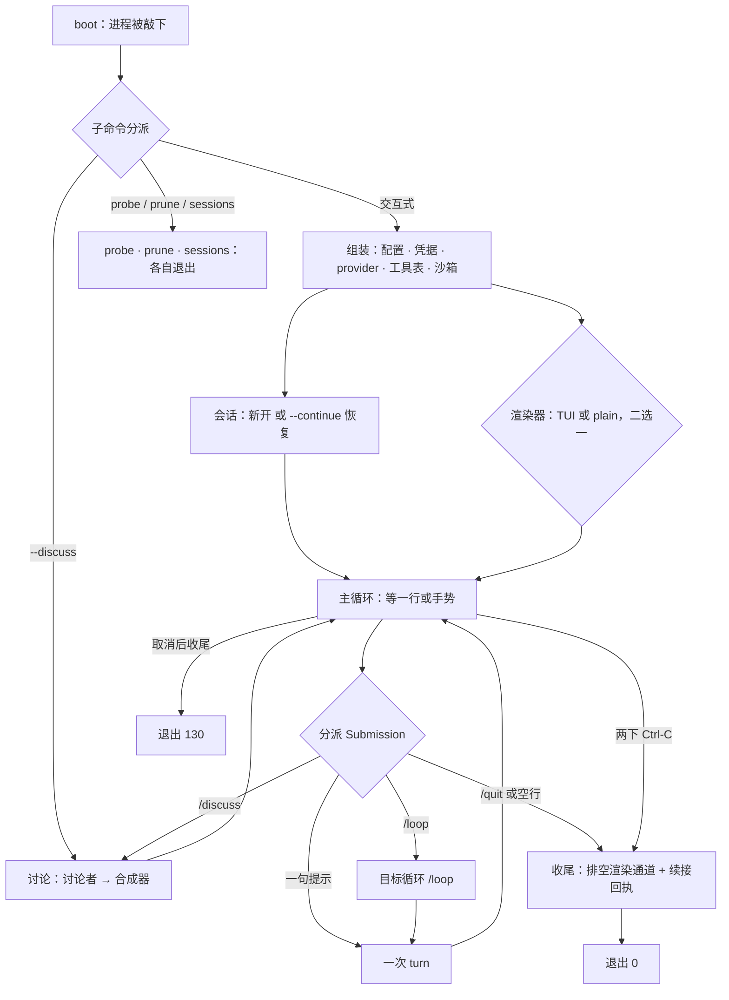
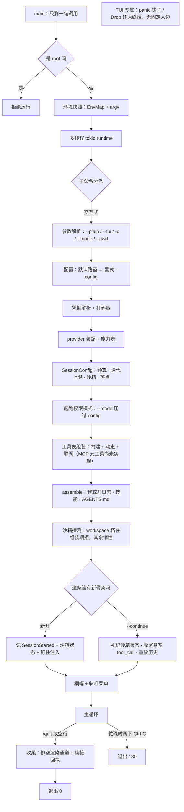
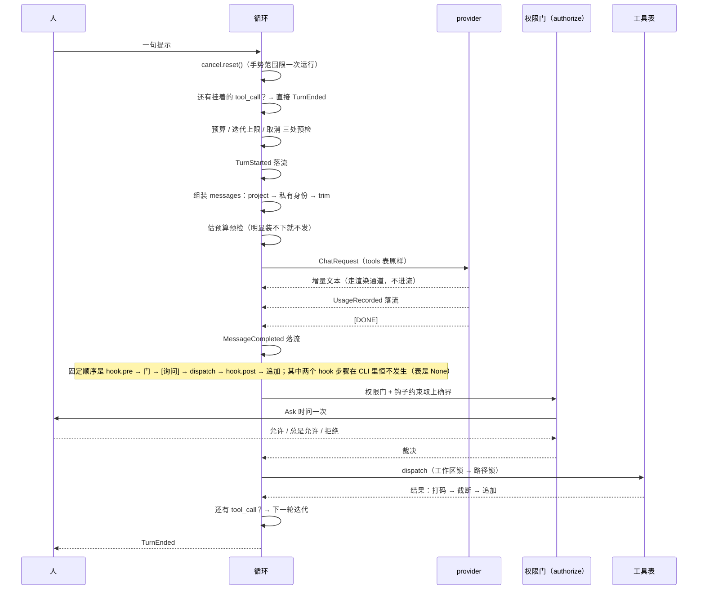
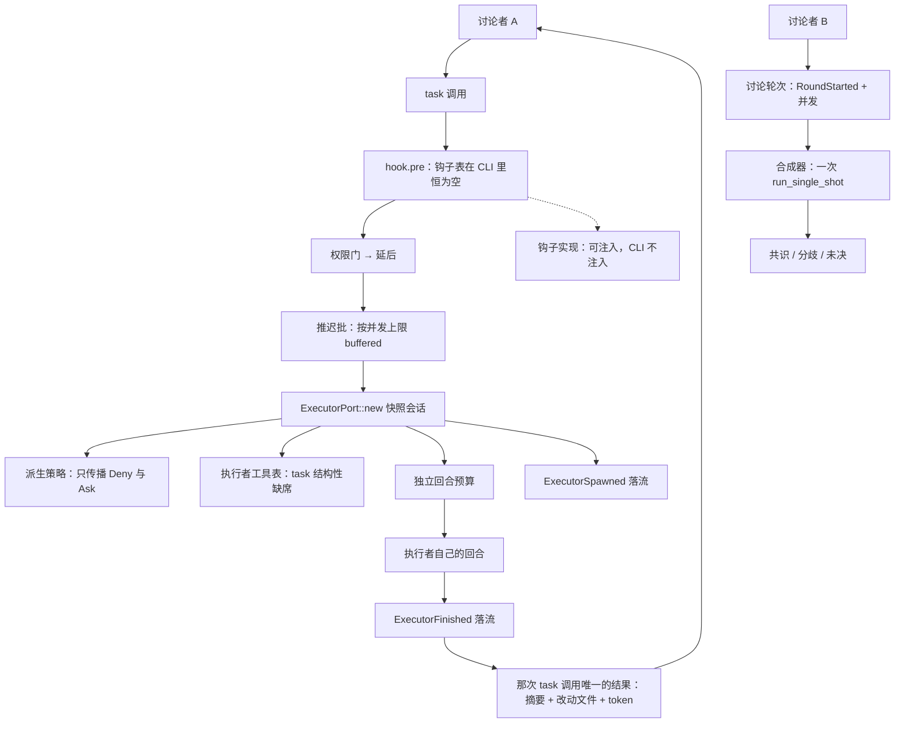
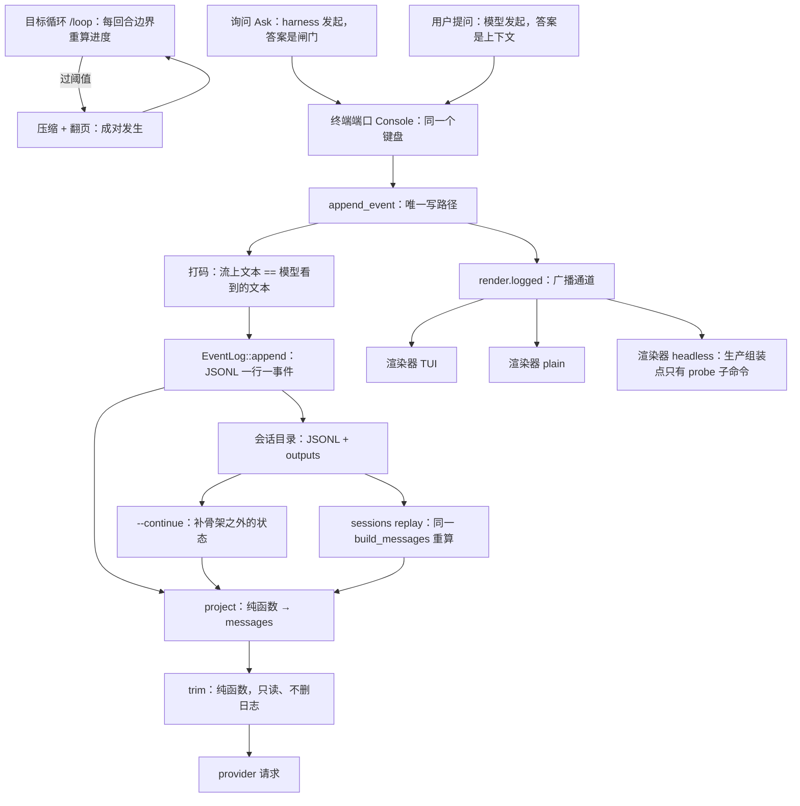

# 运行时生命周期

从敲下 `fs-agent` 到进程退出，这条路上有 24 个可指认的节点、跨四层的边，还有一条只追加的
事件流。这份文档把这段路画成五张 **mermaid** 图（一张鸟瞰 + 四张分层详图），并给每个节点、
每条关键边配上「它在代码的哪一行」的凭据。

- **这份文档讲什么**：**这些东西怎么接起来**。`docs/` 的逐面文档
  （[`executor`](executor.md) · [`permissions`](permissions.md) · [`sandbox`](sandbox.md) ·
  [`goals`](goals.md) · [`render`](render.md) · [`observability`](observability.md) ·
  [`credentials`](credentials.md) · [`web`](web.md) · [`discussion`](discussion.md)）
  讲的是**一个面**的细则与理由；这里只画骨架，每节末尾一张「细则在哪」的指向表把你送过去。
- **怎么读**：先看图 1（鸟瞰）拿到全貌，再按兴趣点进图 2–5；要核对图画得对不对，翻到文末的
  附录证据表 —— 每个节点都写着 `文件:行号` 与符号名。想改这张图，先读 §1。
- **只讲运行时**：构建、安装与配置格式不在范围内。
- **图会腐烂，所以有护栏**：`scripts/lifecycle-check.py` 按 §1 的方言解析这份文档，再把它与
  附录的证据表对账（用法在 [`README.md`](../README.md) 的「开发」一节）。**它守的是指称
  完整性，不是语义正确性** —— 脚本通过只说明每条证据还指得到一个真实符号，不说明这张图
  画对了。那件事只能靠人读图。

## §1 画法约定

这一节是这份文档的**全部**约定：图怎么画、虚实怎么判、脚本按什么解析。

### 1.1 方言：一个受约束的子集

只认下面这些写法，其余一律不写（`scripts/lifecycle-check.py` 遇到不认识的构造会**报红**，
而不是静默跳过）：

| 允许 | 写法 |
| --- | --- |
| 图类型声明 | `flowchart <方向>` 一行（等价的 `graph <方向>` 也认；方向取 `TD` / `TB` / `BT` / `LR` / `RL`） |
| 节点定义 | `id[文本]`（矩形）与 `id{文本}`（菱形） |
| 边 | `id --> id`、`id -.-> id`（虚线）、带标签的 `id -->\|文本\| id` |
| 空行与注释 | 空行；`%%` 之后到行尾是注释 |

**不允许**：`subgraph`、`&` 多节点、链式边（`A --> B --> C`）、
`classDef` / `class` / `style` / `linkStyle` / `click`、`[]` 与 `{}` 之外的节点形状
（`([体育场])`、`[[子程序]]`、`((圆))` 这一族）。禁止项不是洁癖 —— 每一条都是解析器的失效点：
套嵌的括号会让正则切错位置，`&` 与链式边让「一行一条边」的假设不成立，样式语句里的
标识符一半是节点一半不是。

**节点 id 限 `[a-z][a-z0-9_]*`**，避开 `end` / `graph` / `flowchart` 这类关键字与大小写歧义
（`Boot` 与 `boot` 是两个节点）。`sequenceDiagram`（图 3）不进这套方言 —— 它没有
「节点集合」这回事，也就不进 §1.4 那条集合对账。它还有**自己的一套关键字**（`loop` / `alt` /
`opt` / `par` / `end` 等）：participant 与消息里的 id 要避开它们 —— 图 3 的循环参与者因此叫
`core` 而不叫 `loop`，后者会让整张图解析失败（这条是渲染验收抓出来的，护栏脚本管不到图 3）。

### 1.2 先显式定义，后引用

每个节点先用 `id[文本]` 或 `id{文本}` **显式定义一次**，边只引用已经定义过的 id。

这条约定是为了让「边指向一个不存在的节点」可判定：mermaid 原生允许 `A --> B` 顺带**隐式
定义** B（没写标签就拿 id 当标签），所以不立这条约定的话，那种错误在原生语义下几乎不发生 ——
检查器也就无从谈起。id 也不许重复定义（后一次会覆盖前一次，通常是复制粘贴事故）。

### 1.3 虚实：哪些路径画虚线

**实线**：这条路径在**至少一个 CLI 生产组装点**上会被真实走到 —— 三个组装点是交互式
（`src/cli.rs:380`）、`discuss`（`src/cli.rs:700`）、`probe`（`src/cli.rs:2214`）。
「会被走到」不只算主路径：由配置开关打开的（`[web] enabled`、`--tui`）、以及一条 **`None`
的降级分支**（probe 的 `asker: None` 让 `Ask` 降级为 `Deny`），都算走到了。

**虚线**（`-.->`）：只表示下面两类，别的一律不画虚线。

1. **可注入但 CLI 不注入**：类型与端口都在、调用点也在，但**每一个** CLI 生产组装点传的都是
   `None`，且 `src/` 内没有该 trait 的生产实现（只有 `tests/` 的测试替身）。今天唯一一条是
   `hook`（图 4）。
2. **尚未实现**：`src/` 里零命中，但 spec 已定并拆出实现票 —— 也就是说它有一个**已写下来的
   接缝**，不是一句愿望。今天唯一一条是 MCP（图 2 的旁注）。

**不该画虚线的四种情形**（画实线，必要时加旁注）：

- **默认值 + 运行期补齐**：CLI 交类型缺省值、库随后自己填 —— 沙箱的 `availability` 从
  `Untested` 起，由库探一次，生产路径真的走了那件事。
- **前端差异**：某个前端或子命令不接某能力（probe 没有 `asker` / `questions`，`discuss`
  没有 `--mode`，非交互式没有目标循环）—— 只要另一个生产组装点接它、或不接就是那条前端的
  定义，那就是实线分支 + 旁注。
- **配置可选**：`[web] enabled`、`custom__*` 声明、`--tui` 都是组装期输入，缺省关不等于
  路径不存在。
- **测试替身**：`FakeProvider`、`ScriptedHook`、`AlwaysAllow` 只在 `tests/` 里；它们证明端口
  可注入，不证明生产走得到。

**没有代码落点的 roadmap 不进图**：只有 `seed.md` 的意向连类型都没有，画进去会把生命周期图
变成路线图；用正文一句「不在本图范围」交代。

**画法**：虚线用 `-.->`；节点仍须先显式定义。能用旁注说清的（前端差异、缺省关、演进注记）
优先旁注，避免把「这条前端不接」误读成「尚未实现」。

### 1.4 对账：图与附录的证据表

附录的**证据表**是图与代码之间的那根绳：每个节点、每条关键边都落到 `文件:行号`，再配一个
**稳定符号**。行号会随重构漂移，符号不会 —— 所以表是「可核对的」，不是「抄一遍」。

`scripts/lifecycle-check.py` 按 §1.1 的方言解析这份文档，然后检查：

| 检查 | 内容 |
| --- | --- |
| 文件与行数 | 每条 `文件:行号` 的文件存在、行数够（区间 `路径:a-b` 一并认） |
| 符号 | 点名的符号仍在该文件里（按词边界找，不搜裸名字） |
| 引用 | `README.md` 仍引用这份文档（「文档」表或「架构」节任一命中） |
| 集合相等 | **每张图的节点集合 == 它那一节证据表的键集合**，按图分别比、双向分别报 |
| id 唯一 | 同一张图里没有重复定义的节点 id |
| 边端点 | 每条边的两端都已显式定义 |
| 方言 | 只用 §1.1 的写法，不认识的构造报红 |

符号列写「关键词 + 名字」（`fn` / `struct` / `enum` / `trait` / `const` / `static` / `mod` /
`type` / `union`）；一个节点有多个稳定落点时用顿号分隔（`` `fn tui`、`fn plain` ``）。
`impl` 与 `macro_rules!` 不作为证据符号 —— 它们的写法不统一。

**行号漂移只报提示**：在某个文件顶部插一个 `use`，下面所有证据行号都会 +1，而图与代码其实没
脱节。计成失败会让脚本变成噪音机器，`--strict` 才把它当失败。

**约定只有这一处。** `scripts/lifecycle-check.py` 的 docstring 只写一句并指向本节 ——
两份全文必然漂移。

## §2 鸟瞰

**这张图在讲什么。** 一次进程只走一条主干：`boot → cmd` 之后按子命令分叉，交互式那条路
组装好会话与渲染器就进主循环；循环把每一次输入分派给 `turn`、`disc` 或 `goal`，回来的边都
指向循环顶。三条维护子命令（`probe` / `prune` / `sessions`）**各自退出**，既不组装会话、
也不走交互式的收尾路径 —— 所以 `maint` 没有出边，那是它的事实，不是漏画。退出有两条：
`tail → ok`（正常收尾）与 `loop → aborted`（取消后兑现 130）。

三处**有意的简化**，读图时别当成事实：

1. **`render` 与 `sess` 是兄弟，不是父子。** 渲染器在组装期选定（`src/cli.rs:327-372`），
   图 1 把它画成 `setup` 之后的一步只是为了压住总图；真正的先后在图 2 里。
2. **`goal --> turn` 的标签是「每回合边界」。** 目标循环用 `TurnStart::Injected` 驱动每一次
   `run_one_turn`（`src/cli.rs:1626`），不是「进入 turn 之后就不回来了」。
3. **并发画不出来。** 讨论者、执行者都是并发跑各自回合、往同一条流上写，靠 `seq` 切窗而不是
   时序（图 4、图 5）。这张图只表达「存在」。

| 想细看 | 去哪 |
| --- | --- |
| 启动、组装、收尾逐节点展开 | [`图 2 · 进程启动与收尾`](#3-进程启动与收尾) |
| 一次 turn 里每一步的先后与回边 | [`图 3 · 一次 turn`](#4-一次-turn) |
| `task` 派出去之后发生了什么 | [`executor`](executor.md)、[`图 4 · 委派与嵌套`](#5-委派与嵌套) |
| 事件流、渲染器、目标循环怎么接起来 | [`observability`](observability.md)、[`图 5 · 基础设施回路`](#6-基础设施回路) |
| 权限门、沙箱与四档模式 | [`permissions`](permissions.md)、[`sandbox`](sandbox.md) |
| 配置与凭据从哪来 | [`credentials`](credentials.md) |

## §3 进程启动与收尾

**这张图在讲什么。** `main` 只有一句调用；`cli::main` 先查 euid、再建 runtime，然后才碰参数。
交互式那条路上组装是**一条直线**：参数 → 配置 → 凭据与打码器 → provider → `SessionConfig` →
起始权限模式 → 工具表 → `assemble`，之后才惰性探一次沙箱。两条骨架来源（新开 / `--continue`）
在这里合流，再往下是横幅、主循环与三条退出路径。

三处最容易读错的地方：

1. **沙箱探测在 `open` 之后，不是之前。** 组装期唯一的显式检查是 `workspace` 档那一条
   （`src/lib.rs:457`：没有沙箱就拒），非 `workspace` 档直接早退、根本不探；真正的探测在
   `opened.session(...)` 里**惰性做一次**（`src/lib.rs:459-460` → `:279` → `:315-322`）。
   图里画成 `tools → open → probe` 就是这个顺序。
2. **`panic` 是 TUI 专属、而且没有固定入边。** 钩子只在 `TerminalModes::enter` 里装一次
   （`src/render/tui.rs:537`），`Drop` 也只挂在它上面（`:559-563`）；plain / headless 不装任何钩子。
   panic 可以从任意点发生，所以没有「主循环 → panic」这条可指认的控制流边 —— 它画成一个孤立节点。
3. **`refuse` 是断头路，这是有意的。** root 直接拒、无旗标可绕（`src/cli.rs:83-86`），
   别在定稿时给它补一条假边。

| 想细看 | 去哪 |
| --- | --- |
| 四档权限模式、`--mode` 与配置的优先级 | [`permissions`](permissions.md) |
| 沙箱探测、`workspace` 档的组装期拒绝 | [`sandbox`](sandbox.md) |
| 凭据解析与打码器 | [`credentials`](credentials.md) |
| 会话日志、骨架记了什么、`--continue` 怎么重放 | [`observability`](observability.md) |

## §4 一次 turn

**这张图在讲什么。** 一句提示进来，循环先做守卫与三处预检，把 `TurnStarted` 落进流；然后组装
`messages`（`project` → 私有身份 → `trim`，全是纯函数）、估一次预算，才向 provider 发请求。
流式增量走渲染通道、**不进流**；`[DONE]` 之后是 `MessageCompleted`。接着是每次工具调用都一样的
**固定顺序**：`hook.pre → 权限门 → [询问] → dispatch → hook.post → 追加`，走完看还有没有
`tool_call` 决定是否再迭代一轮。

图 1 与图 2 的三处注记：两个 hook 步骤在 CLI 下恒不发生（三个生产组装点全传 `hook: None` —— `src/cli.rs:396` / `src/cli.rs:715` / `src/cli.rs:2232`，`src/` 内没有任何 `Hook` 实现、只有库调用方与测试挂得上，所以图里被压成一条 `Note`、不占步骤的位置，见 §1.3 与 §5）；`权限门` 是抽象的参与者，没有对象持有「询问 → 人答」这次往返（裁决合成在 `src/agent.rs:1954-1995`，问出去的那一问是 `asker.ask(...)` 经 `ConsoleAsker`，去代码里找一个叫 `gate` 的结构会扑空）；「还有挂着的 `tool_call` 就不调 provider」是守卫而不是步骤，它几乎从不触发（`src/agent.rs:478-480`），画进来只为说明不变量 2。

[`README.md`](../README.md) 的「架构」一节有一行式版本
（`hook.pre → 权限门 → [询问] → dispatch → hook.post → 追加事件`）—— 那是这条链的另一面，
这张图是它的展开，不是替代。

| 想细看 | 去哪 |
| --- | --- |
| 权限门的三值裁决与询问往返 | [`permissions`](permissions.md) |
| 投影、裁剪与流 | [`observability`](observability.md) |
| `TurnScope` 的三种窗口（主会话 / 讨论轮次 / 执行者） | [`executor`](executor.md) |
| 工具侧的工作区锁与路径锁 | [`bash`](bash.md) |

## §5 委派与嵌套

**这张图在讲什么。** `task` 调用走的是和别的工具一样的固定顺序，但它的门之后多一条岔路：
被授权的调用**不就地执行**，而是进「推迟批」，由 `ExecutorPort::new` 从父会话快照派生出一个
执行者（三条并列的派生 + 它自己的回合预算），跑完把 `ExecutorSpawned` / `ExecutorFinished` 落进
**同一条**流，最后回来的是**那一整次** `task` 调用的唯一一条结果。图的下半是讨论轮次与合成器。

三处必须说清的地方：

1. **两个讨论者并发，图只表达「存在」。** 它们各跑各的回合、往同一条流上写，独立性靠 `seq` 切窗
   而不是时序（`src/agent.rs:1334-1427`）；执行者的推迟批同理。画法约定**不为并发发明语法** ——
   并发事实用正文这一句交代。
2. **`合成器` 不是第三种 agent。** 它没有工具、没有回合、不参与轮次（`CONTEXT.md`），只是
   `round → syn` 那一次 `run_single_shot`。用一个节点画它，别读成「执行者之外的第二种委派」。
3. **`spawn` 分出的三条是并列的，不是流水线。** 派生策略、工具表与回合预算各自从父会话快照派生
   （`src/agent/executor.rs:107-134`）；画成 `policy → table → budget` 会读成有先后依赖。

图里**唯一一条虚线**是 `pre -.-> hooks`：钩子的端口与两个挂载点都在，但三个生产组装点全传
`None`，`src/` 内没有实现 —— 那是 §1.3 的第一类虚线。`pre` 与 `post` 共用一个 `None`，画一条就够。

| 想细看 | 去哪 |
| --- | --- |
| 执行者的可见性、预算与「深度为一」 | [`executor`](executor.md) |
| 讨论、轮次与合成器 | [`discussion`](discussion.md) |
| 只传播 `Deny` / `Ask`、`Allow` 不传播 | [`permissions`](permissions.md) |
| `ExecutorSpawned` / `ExecutorFinished` 在流上的形状 | [`observability`](observability.md) |

## §6 基础设施回路

**这张图在讲什么。** 上面那条是**每回合**回路：`append_event` 是唯一写路径，打码在追加**之前**
（于是「流上文本 == 模型看到的文本」），落进 JSONL 之后由 `project → trim` 两个纯函数重算出这一
回合的 `messages`。下面那条是**跨会话**回路：目标循环在每个回合边界判一次阈值，过了才压缩 + 翻页。
右侧是同一根广播通道上的三个渲染器；底部是两类问询发起者与它们共用的那一个终端端口。

四件事必须说清：

1. **两条回路不是一条。** `emit → red → log → proj → trim → req` 每个回合都走；
   `goal ↔ compact` 是跨会话的，过阈值才走（`src/cli.rs:1711-1716`、`src/goals.rs:629-640`）。
   画在一起容易被读成一条。
2. **`append_event` 是唯一写路径，打码在它之前。** 于是流上的文本 == 模型看到的文本；
   `outputs/*.txt` 打码、`outputs/*.before` 不打码 —— 后者是 `/undo` 的字节级还原源。
3. **两类问询发起者不共用接缝。** `ask`（询问：harness 发起，答案是闸门）走 `Asker` /
   `ConsoleAsker`；`uq`（用户提问：模型发起，答案是上下文）走 `UserQuestions` /
   `ConsoleQuestions`。两条端口，同一个键盘 —— 图里合并到 `console` 是简化。
4. **`headless` 不是虚线。** 它在 `probe` 子命令里真被构造（`src/cli.rs:2238`，在
   `#[cfg(test)]` 之外）—— 别写成「CLI 不构造」，也别画成 §1.3 的第二类虚线。

| 想细看 | 去哪 |
| --- | --- |
| 事件流、投影、裁剪、打码 | [`observability`](observability.md)、[`credentials`](credentials.md) |
| 目标循环的阈值与翻页 | [`goals`](goals.md) |
| 三个渲染器 | [`render`](render.md) |
| 询问与用户提问那两条端口 | [`permissions`](permissions.md) |
| 钉住的注入（技能与 `AGENTS.md`） | [`skills`](skills.md) |

## §7 图上不能断的边

五张图给**骨架**，这一节给**判据**：仓库里有 12 条不变量，它们散在 `README.md` 的段落与各份 ADR
里，没有一处和图上的边对上。改动之前先来这里看有没有你正在碰的那条 —— 每条都写着它说什么、
对应图上哪条边、证据在哪几行、**破坏了会怎样**。

### 1. 事件流是唯一真相源

- **说什么**：`messages` 每个回合从流上重算，从不存下来。
- **图上的边**：图 5 的 `log → proj → trim → req`；`cont → proj` 与 `replay → proj` 是同一件事的
  另外两条入口。
- **证据**：`src/lib.rs:3-4`、`src/agent.rs:181-205`、`src/provider/projection.rs:46`
- **破坏了会怎样**：`messages` 一旦被缓存或从别处读，`--continue`、`/undo` 与 `sessions replay`
  就会和主路径给出不同的上下文 —— 而流上的 `seq` 不再是唯一身份。

### 2. `append_event` 是唯一写路径，打码在追加之前

- **说什么**：所有事件都经 `append_event` 落盘，且打码发生在追加**之前**。
- **图上的边**：图 5 的 `emit → red → log`，以及 `emit → rlog`。
- **证据**：`src/agent.rs:2054-2070`、`src/agent.rs:2203-2227`、`src/events.rs:513-530`
- **破坏了会怎样**：绕开它直接写文件，打码就被跳过 —— 密钥会进流、进详情弹窗、进 `outputs/`；
  同时 `seq` 也不再等于行号，投影与回放一起失效。

### 3. 工具表组装后不变

- **说什么**：动态工具与联网工具都在组装期入表，之后再不改动 —— 表是缓存前缀的一部分。
- **图上的边**：图 2 的 `mode → tools`（**没有回边**）。
- **证据**：`src/cli.rs:386-389`、`src/tools/mod.rs:96-118`、`src/tools/registry.rs:88-93`
- **破坏了会怎样**：运行期往表里加一个工具，每个会话的缓存前缀就作废一次（全量未命中），
  而且模型看到的工具集合与流里记下的那次请求不再对得上。

### 4. 权限门在沙箱之外，且是纯函数

- **说什么**：门答「跑不跑」，沙箱答「能碰到什么」；两件事各在各的层里。
- **图上的边**：图 3 的 `core → gate → tools`；沙箱在图 2 的 `tools` 内部（`probe` 那一步定它）。
- **证据**：`src/lib.rs:389-397`、`src/permissions.rs:530`、`src/tools/process.rs:11-13`
- **破坏了会怎样**：把沙箱判断塞进门，门就不再是纯函数、不再可单测，`workspace` 档的语义也漏进
  了裁决层 —— 而「门之外还有一层内核担保」这句话从此不成立。

### 5. 每次工具调用的固定顺序

- **说什么**：`hook.pre → 门 → [询问] → dispatch → hook.post → 追加`，一步都不许换位。
- **图上的边**：图 3 从那条 `Note` 起的六条相邻消息；图 4 的 `task → pre → gate`。
- **证据**：`src/agent.rs:3-7`、`src/agent.rs:896-1131`、`src/hooks.rs:99`
- **破坏了会怎样**：把权限判断挪到门之后（或挪到 dispatch 之后），就会有一次执行没经过裁决；
  钩子也可能拦不住它本来能收紧的那一次调用。

### 6. 每个 `tool_call` 恰好一个结果

- **说什么**：每个 `tool_call` 恰好配一条结果；有挂起调用时绝不调 provider。
- **图上的边**：图 3 的 `挂着的 tool_call？→ TurnEnded` 与 `tools → loop: 结果`。
- **证据**：`src/agent.rs:9-13`、`src/agent.rs:478-480`、`src/agent.rs:2040-2043`
- **破坏了会怎样**：少一条结果，下一次请求里就出现「有调用没结果」的历史，多数 provider 直接报错；
  多一条结果，同一个 `tool_call_id` 有两份答案，回放与 `/undo` 认不出哪条算数。

### 7. 取消只向下

- **说什么**：取消沿 token 树向下传播、从不向上；手势是运行级的，不进流。
- **图上的边**：图 1 的 `loop →|两下 Ctrl-C| tail` 与 `loop →|取消后收尾| aborted`；图 4 里执行者
  继承派发者的取消观察端。
- **证据**：`src/agent/cancel.rs:8-15`、`src/agent/executor.rs:84-86`、`src/lib.rs:667-670`
- **破坏了会怎样**：子会话能反过来取消父会话，一次 `Ctrl-C` 就会从执行者波及整场讨论；而手势
  本身不进流，事后没有任何记录能解释这次中断从哪来。

### 8. 委派深度为一，由工具表强制

- **说什么**：执行者不能再派执行者 —— 它的表里**根本没有** `task`。
- **图上的边**：图 4 的 `spawn → table`（`task` 结构性缺席）。
- **证据**：`src/tools/registry.rs:70-78`、`src/tools/tool.rs:242-248`、`docs/executor.md:70-76`
- **破坏了会怎样**：改用一条规则来挡，执行者仍会看到 `task` 的声明，而规则里的一个 bug 就是一个
  递归 bug —— 深度、成本与并发都不再有上限。

### 9. `Allow` 不传播

- **说什么**：沿委派链向下只继承 `Deny` 与 `Ask`，`Allow` 从不往下传。
- **图上的边**：图 4 的 `spawn → policy`。
- **证据**：`src/permissions.rs:414-427`、`src/agent/executor.rs:98-111`
- **破坏了会怎样**：`Allow` 跟着走，「派个子 agent 去写」就成了绕过用户刚才那个「拒绝」的路 ——
  委派从执行手段变成提权路径。

### 10. `workspace` 档离开沙箱就不存在

- **说什么**：这一档的全部承诺都建立在沙箱上；没有沙箱时它在组装期就被拒。
- **图上的边**：图 2 的 `tools → open`（组装期那次拒绝就在 `open` 里）与 `open → probe`；
  会话里 `Shift+Tab` 再跳过一次（图 1 的 `loop` 收手势）。
- **证据**：`src/lib.rs:398-414`、`src/lib.rs:1146-1156`、`src/tools/sandbox.rs:48-83`
- **破坏了会怎样**：关掉沙箱仍然允许 `workspace` 档，「区内自动、区外要问」就失去内核担保，
  区外的写会真的落盘 —— 用户以为还有一道墙，其实没有了。

### 11. 两个讨论者共享同一条流

- **说什么**：讨论的两位并发写同一条流，独立性靠 `seq` 切窗而不是时序。
- **图上的边**：图 4 的 `deb → task`、`deb2 → round` 与 `one → deb`。
- **证据**：`src/events.rs:925-929`、`src/agent.rs:58-79`、`src/agent.rs:1414-1427`
- **破坏了会怎样**：给讨论者各开一条流，`/undo` 与转录就不再覆盖整场讨论，`seq` 切窗失效，
  两位发言的交错顺序失去唯一解释。

### 12. 合成器那一次调用绝不跳过

- **说什么**：预算硬停是把它**降级进**合成器，而不是越过它。
- **图上的边**：图 4 的 `round → syn`。
- **证据**：`src/agent.rs:1382-1398`、`src/agent.rs:1525-1548`、`src/agent.rs:1598-1599`
- **破坏了会怎样**：预算耗尽就直接结束讨论，钱已经花了，用户却拿不到共识 / 分歧 / 未决 ——
  这正是合成器存在的理由（它是那条「花了钱要有结论」的边）。

## 附录：逐图证据表

每张图一节，节点表与边表各一份。**证据列是给人和脚本核对的**：行号会漂，符号不会。

### 图 1 的节点

| 节点 id | 一句话 | 证据 | 符号 |
| --- | --- | --- | --- |
| `boot` | 进程入口，`main` 只调 `cli::main()` | `src/main.rs:1-3`、`src/cli.rs:78-103` | `fn main` |
| `cmd` | 子命令分派：`--version` / `--help` / `probe` / `discuss` / `prune` / `sessions`，其余交互式 | `src/cli.rs:105-129` | `fn run` |
| `setup` | 组装：配置 · 凭据 · provider · 工具表 · 沙箱 | `src/cli.rs:234-411` | `fn interactive` |
| `sess` | 会话：新开或 `--continue` / `--session` 恢复 | `src/cli.rs:289-297`、`src/cli.rs:2633-2677` | `fn choose_session` |
| `render` | 渲染器选定 TUI / plain（headless 见 §6） | `src/cli.rs:327-372`、`src/render/mod.rs:161-200` | `fn tui`、`fn plain` |
| `loop` | 主循环：等一行或手势 | `src/cli.rs:1102-1313` | `fn interactive_loop` |
| `route` | 分派 `Submission` | `src/cli.rs:1183-1307`、`src/cli.rs:1380-1433` | `fn submission` |
| `turn` | 一次 turn | `src/lib.rs:658-682`、`src/agent.rs:443-732` | `fn run_turn` |
| `disc` | 讨论：`--discuss` 子命令与会话内 `/discuss` | `src/cli.rs:545-770`、`src/cli.rs:950-1052`、`src/agent.rs:1334-1585` | `fn run_discussion` |
| `goal` | 目标循环 `/loop` | `src/cli.rs:1546-1803` | `fn run_goal_loop` |
| `maint` | `probe` · `prune` · `sessions` 三条独立子命令，各自退出 | `src/cli.rs:115-124`、`src/cli.rs:2102`、`src/cli.rs:2392`、`src/cli.rs:2550` | `fn run_sessions` |
| `tail` | 收尾：排空渲染通道 + 续接回执 | `src/cli.rs:460-474`、`src/lib.rs:1080-1081` | `fn finish_session`、`fn shutdown` |
| `ok` | 退出 0（空输入、`/quit`、`Ignore`、正常收尾） | `src/cli.rs:1177-1187`、`src/cli.rs:1973-1978` | `fn exit_code_after` |
| `aborted` | 退出 130（忙碌中被举手退出，等回合收尾后兑现） | `src/cli.rs:1310-1312`、`src/cli.rs:1988-2015` | `struct ExitRequest` |

### 图 1 的边

| 边 | 证据 | 说明 |
| --- | --- | --- |
| `boot --> cmd` | `src/main.rs:1-3` | `main` 无逻辑，直接进 `cli::main` |
| `cmd -->\|交互式\| setup` | `src/cli.rs:127` | 没有子命令就是交互式 |
| `cmd -->\|--discuss\| disc` | `src/cli.rs:116` | `discuss` 子命令独立组装 |
| `cmd -->\|probe / prune / sessions\| maint` | `src/cli.rs:115-124` | 三条各自 `return` 自己的 `ExitCode` |
| `setup --> sess` | `src/cli.rs:289-297` | `choose_session` 决定开哪一场 |
| `setup --> render` | `src/cli.rs:327-372` | 渲染器在组装前选定并注入 |
| `sess --> loop` | `src/cli.rs:446-459` | `interactive_loop(...)` 被调 |
| `render --> loop` | `src/cli.rs:446-459` | 同上；两条入边是图 1 的有意合并 |
| `loop --> route` | `src/cli.rs:1183` | 拿到一行后交给 `submission` |
| `route -->\|一句提示\| turn` | `src/cli.rs:1297-1306`、`src/cli.rs:2033` | `Submission::Prompt` → `TurnStart::Prompt` |
| `route -->\|/discuss\| disc` | `src/cli.rs:1244-1253` | 走 `discuss_in_session` |
| `route -->\|/loop\| goal` | `src/cli.rs:1275-1295` | 走 `run_goal_loop` |
| `route -->\|/quit 或空行\| tail` | `src/cli.rs:1177-1187` | `None` 与 `Quit` 都 `ExitCode::SUCCESS` |
| `turn --> loop` | `src/cli.rs:1307` | 处理完回到循环顶 |
| `disc --> loop` | `src/cli.rs:1307` | 讨论结束回到循环顶 |
| `goal --> turn` | `src/cli.rs:1626` | 每回合边界用 `TurnStart::Injected` 驱动 |
| `tail --> ok` | `src/cli.rs:1973-1978` | `exit_code_after(false)` |
| `loop -->\|两下 Ctrl-C\| tail` | `src/cli.rs:1164-1168` | 空闲时收到 `Quit` |
| `loop -->\|取消后收尾\| aborted` | `src/cli.rs:2044-2052`、`src/cli.rs:1310-1312` | 忙时先取消，回合收尾后兑现 130 |

### 图 2 的节点

| 节点 id | 一句话 | 证据 | 符号 |
| --- | --- | --- | --- |
| `main` | 只剩一句调用 | `src/main.rs:1-3` | `fn main` |
| `root` | 先于参数、先于 runtime 检查 euid | `src/cli.rs:73-86` | `fn root_refusal` |
| `refuse` | root 直接拒、无旗标可绕 | `src/cli.rs:83-86` | — |
| `env` | `EnvMap` + `argv`（去首参） | `src/cli.rs:87-88` | — |
| `rt` | 多线程 tokio runtime，失败即退 | `src/cli.rs:89-102` | — |
| `cmd` | 子命令分派 | `src/cli.rs:105-129` | `fn run` |
| `parse` | 交互式参数解析，两渲染器互斥 | `src/cli.rs:161-219` | `fn parse_interactive` |
| `cfg` | 显式 `--config` 必须存在，否则默认路径 | `src/cli.rs:247-253`、`src/cli.rs:2087-2100` | `fn load_config` |
| `red` | 每条 provider key 解析一次，打码器持全部值 | `src/config.rs:713-720`、`src/events.rs:611-630` | `fn redactor` |
| `prov` | provider 装配 + 能力表（双保险） | `src/cli.rs:299-305`、`src/cli.rs:334-340`、`src/provider/openai.rs:101-127`、`src/provider/capability.rs:83` | `fn build`、`fn caps_for` |
| `scfg` | `SessionConfig`：预算 · 迭代上限 · 沙箱 · 落点 | `src/cli.rs:306-312`、`src/config.rs:696-706` | `fn session_config` |
| `mode` | 起始权限模式：`--mode` 压过 `[permissions] mode` | `src/cli.rs:226-228`、`src/cli.rs:323` | `fn effective_mode` |
| `tools` | 工具表组装：内建 + 动态 + 联网，组装期定死 | `src/cli.rs:386-389`、`src/tools/mod.rs:96-130` | `fn with_dynamic`、`fn with_web` |
| `probe` | 沙箱探测：`mode="off"` 或已给结果则不探 | `src/lib.rs:315-322`、`src/tools/sandbox.rs:48-83` | `fn sandbox_availability`、`fn probe` |
| `open` | `assemble`：建/开日志 · 技能 · `AGENTS.md` · 起渲染器 | `src/lib.rs:217-275`、`src/lib.rs:448-470` | `fn open`、`fn assemble` |
| `kind` | 这条流有没有 `SessionStarted` | `src/lib.rs:244-252` | — |
| `skel` | 新流：`SessionStarted` + 沙箱状态 + 钉住注入 | `src/lib.rs:366-386` | `fn record_skeleton` |
| `resume` | 续流：补记沙箱状态 · 收尾悬空 `tool_call` · 重放历史 | `src/lib.rs:330-345`、`src/agent/history.rs:40-61`、`src/cli.rs:417-419` | `fn start`、`fn recover_pending_calls` |
| `banner` | 横幅走渲染通道；`/` 菜单 = 内建 + 已发现技能 | `src/cli.rs:423-444`、`src/render/wording.rs:1657` | `fn banner` |
| `loop` | 主循环 | `src/cli.rs:1102-1313` | `fn interactive_loop` |
| `quit` | 排空渲染通道，然后 stderr 打续接回执 | `src/cli.rs:460-474`、`src/lib.rs:1161-1164` | `fn finish_session`、`fn drain_renderer` |
| `ok` | 退出 0 | `src/cli.rs:1177-1187`、`src/cli.rs:1973-1978` | `fn exit_code_after` |
| `cc` | 退出 130：忙时第一下取消、第二下记 `ExitRequest` | `src/cli.rs:1988-2015`、`src/cli.rs:2044-2052` | `struct ExitRequest` |
| `panic` | TUI 的 panic 钩子 + `Drop` 还原终端（见 §3 正文） | `src/render/tui.rs:526-563`、`src/render/tui.rs:470-471` | `struct TerminalModes` |

### 图 2 的边

| 边 | 证据 | 说明 |
| --- | --- | --- |
| `main --> root` | `src/cli.rs:82-86` | euid 检查在任何别的事之前 |
| `root -->\|是\| refuse` | `src/cli.rs:83-85` | 断头路，直接 `ExitCode::FAILURE` |
| `root -->\|否\| env` | `src/cli.rs:87-88` | 收环境与 argv |
| `env --> rt` | `src/cli.rs:89-102` | 建 runtime |
| `rt --> cmd` | `src/cli.rs:102` | `block_on(run)` |
| `cmd -->\|交互式\| parse` | `src/cli.rs:127`、`src/cli.rs:239` | `interactive` 第一步 |
| `parse --> cfg` | `src/cli.rs:247` | `load_config` |
| `cfg --> red` | `src/config.rs:713-720` | 打码器随 `session_config` 同行 |
| `red --> prov` | `src/cli.rs:299` | provider 装配 |
| `prov --> scfg` | `src/cli.rs:306` | `session_config` |
| `scfg --> mode` | `src/cli.rs:323` | 三种消费者共用同一答案 |
| `mode --> tools` | `src/cli.rs:386-389` | 工具表在组装处定死 |
| `tools --> open` | `src/lib.rs:448-460` | 工具表装进 scaffold，`assemble` 才开日志 |
| `open --> probe` | `src/lib.rs:459-460`、`src/lib.rs:315-322` | 探测在 `session()` 里惰性做一次 |
| `probe --> kind` | `src/lib.rs:244-252` | 看日志里有没有 `SessionStarted` |
| `kind -->\|新开\| skel` | `src/lib.rs:331-332` | `!resuming` |
| `kind -->\|--continue\| resume` | `src/lib.rs:334-344` | 补沙箱状态 + 收尾悬空调用 + 重放 |
| `skel --> banner` | `src/cli.rs:417-429` | 骨架先于横幅 |
| `resume --> banner` | `src/cli.rs:417-429` | 重放先于横幅 |
| `banner --> loop` | `src/cli.rs:446-459` | 进主循环 |
| `loop -->\|/quit 或空行\| quit` | `src/cli.rs:1177-1187`、`src/cli.rs:462` | `harness.shutdown()` |
| `loop -->\|忙碌时两下 Ctrl-C\| cc` | `src/cli.rs:2044-2052` | 先等回合收尾，再兑现 130 |
| `quit --> ok` | `src/cli.rs:1973-1978` | `finish_session` 原样返回 `code` |

### 图 3 的参与者

图 3 是 `sequenceDiagram`，没有「节点集合」这回事，**不进 §1.4 那条集合对账** ——
这张表由人核。

| 参与者 | 一句话 | 证据 | 符号 |
| --- | --- | --- | --- |
| `human` | 键盘：提示、手势、权限询问与用户提问共用同一个终端端口 | `src/render/input.rs:127-140`、`src/render/input.rs:205-215` | `struct ConsoleHandle`、`fn console` |
| `core` | 循环：驱动回合、盯手势 | `src/cli.rs:1102-1313`、`src/cli.rs:2023-2053`、`src/lib.rs:667-682` | `fn run_one_turn`、`fn drive_turn` |
| `prov` | provider：请求、流式返回 | `src/provider/mod.rs:34-42` | `trait Provider` |
| `gate` | 权限门：纯函数裁决 + 询问往返（抽象参与者，见 §4） | `src/permissions.rs:530-640`、`src/agent.rs:1841-1998` | `fn decide`、`fn authorize` |
| `tools` | 工具表：锁与派发 | `src/tools/registry.rs:170-216` | `fn dispatch` |

### 图 3 的消息

| 消息 | 证据 | 说明 |
| --- | --- | --- |
| `human->>core: 一句提示` | `src/render/input.rs:133`、`src/cli.rs:1158-1160` | `console.prompt()` |
| `core->>core: cancel.reset()` | `src/lib.rs:667-672` | 手势范围限一次运行 |
| `core->>core: 挂着的 tool_call？→ TurnEnded` | `src/agent.rs:478-480` | 守卫，不变量 2，直接 `StopReason::Error` |
| `core->>core: 预算 / 迭代上限 / 取消 三处预检` | `src/agent.rs:484-521` | 顺序是取消 → 预算 → 迭代上限 |
| `core->>core: TurnStarted 落流` | `src/agent.rs:523-531` | — |
| `core->>core: 组装 messages` | `src/agent.rs:535-542`、`src/agent.rs:181-205`、`src/provider/projection.rs:46`、`src/context.rs:138` | project → 私有身份 → trim |
| `core->>core: 估预算预检` | `src/agent.rs:548-560`、`src/context.rs:70` | `estimate_messages_tokens` + `admits_estimate` |
| `core->>prov: ChatRequest（tools 表原样）` | `src/agent.rs:562-569`、`src/agent.rs:574-581` | `tools: session.tools().specs()` |
| `prov-->>core: 增量文本（走渲染通道）` | `src/agent.rs:607-614` | `render.text_delta`，不进流 |
| `prov-->>core: UsageRecorded 落流` | `src/agent.rs:631-638` | 唯一的用量账本 |
| `prov-->>core: [DONE]` | `src/agent.rs:639-649`、`src/agent.rs:672-677` | 只有 `[DONE]` 才算完成单位 |
| `core->>core: MessageCompleted 落流` | `src/agent.rs:679-690` | — |
| `Note over core: 固定顺序` | `src/agent.rs:1-7`、`src/hooks.rs:99`、`src/agent.rs:896-1131` | `hook.pre` / `hook.post` 在 CLI 下恒不发生，见 §4 |
| `core->>gate: 权限门 + 钩子约束取上确界` | `src/agent.rs:998-1007`、`src/hooks.rs:99` | `Allow < Ask < Deny` |
| `gate->>human: Ask 时问一次` | `src/agent.rs:1904-1954`、`src/permissions.rs:974-1012`、`src/render/input.rs:251` | 没有 asker 则降级 `Deny` |
| `human-->>gate: 允许 / 总是允许 / 拒绝` | `src/agent.rs:1954-1995`、`src/permissions.rs:996-1004` | `Answer` 三值 |
| `gate-->>core: 裁决` | `src/agent.rs:998-1007` | 与钩子约束取上确界之后 |
| `core->>tools: dispatch（工作区锁 → 路径锁）` | `src/agent.rs:1078-1112`、`src/tools/registry.rs:178-185` | — |
| `tools-->>core: 结果：打码 → 截断 → 追加` | `src/agent.rs:2053-2087` | `emit_completed` |
| `core->>core: 还有 tool_call？→ 下一轮迭代` | `src/agent.rs:726-728` | `last_assistant_has_tool_calls` |
| `core-->>human: TurnEnded` | `src/agent.rs:2182-2192`、`src/agent.rs:730` | `end_turn{Completed}` |

### 图 4 的节点

| 节点 id | 一句话 | 证据 | 符号 |
| --- | --- | --- | --- |
| `deb` | 讨论者 A：并发跑自己的回合、共享一条流 | `src/lib.rs:566-605`、`src/cli.rs:900-948`、`src/agent.rs:1334-1427` | `fn discussion_participants` |
| `deb2` | 讨论者 B：同一条规则 | `src/lib.rs:566-605`、`src/cli.rs:900-948`、`src/agent.rs:1334-1427` | `fn discussion_participants` |
| `task` | `task` 工具调用：先判预算、再构造端口并推迟 | `src/agent.rs:1044-1076` | — |
| `pre` | `hook.pre`：在门之前，能拦下一次询问 | `src/agent.rs:896-994` | — |
| `gate` | 权限门 → 通过后决定推迟还是就地派发 | `src/agent.rs:998-1007`、`src/agent.rs:1035-1077`、`src/agent.rs:1841` | `fn authorize` |
| `hooks` | 钩子实现：可注入，CLI 不注入 | `src/hooks.rs:169-181`、`src/lib.rs:94`、`tests/hook_mount_points.rs:297-298` | `trait Hook` |
| `pool` | 推迟批：按 `max_parallel_executors` buffered | `src/agent.rs:1140-1178` | `fn run_deferred` |
| `spawn` | `ExecutorPort::new` 快照会话 | `src/agent/executor.rs:90-140` | `fn new` |
| `policy` | 派生策略：只传播 `Deny` 与 `Ask` | `src/agent/executor.rs:107-111`、`src/permissions.rs:414-420` | `fn inherited_rules` |
| `table` | 执行者工具表：`task` 结构性缺席 | `src/agent/executor.rs:134`、`src/tools/registry.rs:70-78`、`src/tools/tool.rs:242-248` | `fn for_executor`、`fn delegable` |
| `budget` | 独立回合预算：`executor_max_iterations` | `src/agent/executor.rs:118`、`src/config.rs:41-45` | `const DEFAULT_MAX_ITERATIONS` |
| `run` | 执行者自己的回合（`TurnScope::Executor`） | `src/agent/executor.rs:184-192`、`src/agent.rs:443-732` | `fn run_turn` |
| `spawned` | `ExecutorSpawned` 落流（简报先记） | `src/agent/executor.rs:148-159` | — |
| `finished` | `ExecutorFinished` 落流 | `src/agent/executor.rs:204-215` | — |
| `one` | 那次 `task` 调用唯一的结果：摘要 + 改动文件 + token | `src/agent/executor.rs:217-231`、`src/agent/executor.rs:305-324` | `fn executor_report` |
| `round` | 讨论轮次：`RoundStarted` + `join_all` 并发 | `src/agent.rs:1400-1427` | — |
| `syn` | 合成器：一次 `run_single_shot` | `src/agent.rs:1525-1548`、`src/agent.rs:1600` | `fn run_single_shot` |
| `out` | 共识 / 分歧 / 未决 | `src/agent.rs:1574-1584`、`CONTEXT.md:36-38` | — |

### 图 4 的边

| 边 | 证据 | 说明 |
| --- | --- | --- |
| `deb --> task` | `src/agent.rs:702-711` | 回合里逐条调 `process_call` |
| `deb2 --> round` | `src/agent.rs:1409-1417` | 每轮 `RoundStarted` 之后 `join_all` |
| `task --> pre` | `src/agent.rs:890-891` | `resolve_facts` 之后立刻 `hook.pre` |
| `pre --> gate` | `src/agent.rs:998-1007` | 门在钩子之后，取上确界 |
| `pre -.-> hooks` | `src/agent.rs:903-917`、`src/cli.rs:396` | CLI 恒 `None`，测试可注入 |
| `gate --> pool` | `src/agent.rs:1072-1076` | `task` 被推迟 |
| `pool --> spawn` | `src/agent.rs:1155-1176`、`src/agent/executor.rs:236-238` | `dispatch` → `ExecutorSpawner::spawn` |
| `spawn --> policy` | `src/agent/executor.rs:107-111` | 三条并列派生之一 |
| `spawn --> table` | `src/agent/executor.rs:134` | 三条并列派生之一 |
| `spawn --> budget` | `src/agent/executor.rs:118` | 三条并列派生之一 |
| `budget --> run` | `src/agent/executor.rs:184-192` | — |
| `spawn --> spawned` | `src/agent/executor.rs:148-159` | 做任何事之前先记 |
| `run --> finished` | `src/agent/executor.rs:204-215` | — |
| `finished --> one` | `src/agent/executor.rs:219-231` | 元数据从流派生 |
| `one --> deb` | `src/agent/executor.rs:226-230` | 成功是 `ToolOutput`，否则 `ToolError` |
| `round --> syn` | `src/agent.rs:1516-1533` | 取消时**不**靠近合成器 |
| `syn --> out` | `src/agent.rs:1567-1584` | — |

### 图 5 的节点

| 节点 id | 一句话 | 证据 | 符号 |
| --- | --- | --- | --- |
| `emit` | `append_event`：唯一写路径 | `src/agent.rs:2215-2227` | `fn append_event` |
| `red` | 打码在追加之前，于是「流上文本 == 模型看到的文本」 | `src/agent.rs:2223`、`src/events.rs:513-530`、`src/events.rs:641-665` | `fn redact` |
| `log` | `EventLog::append`：JSONL 一行一事件 | `src/events.rs:1009-1038` | `fn append` |
| `disk` | 会话目录：JSONL + `outputs/` | `src/events.rs:948-1002`、`src/lib.rs:233-236` | `fn create`、`fn open` |
| `rlog` | `render.logged`：广播通道 | `src/render/mod.rs:104-145` | `fn logged` |
| `tui` | 渲染器 TUI | `src/cli.rs:353-361`、`src/render/mod.rs:179`、`src/render/mod.rs:194-197` | `fn tui` |
| `plain` | 渲染器 plain | `src/cli.rs:364-371`、`src/render/mod.rs:175`、`src/render/mod.rs:190-193` | `fn plain` |
| `headless` | 渲染器 headless（生产组装点只有 `probe`，见 §6） | `src/render/mod.rs:171`、`src/render/mod.rs:186-189`、`src/cli.rs:2238` | `fn headless` |
| `proj` | `project`：纯函数 → `messages` | `src/provider/projection.rs:46` | `fn project` |
| `trim` | `trim`：纯函数，只读、不删日志 | `src/context.rs:138-180` | `fn trim` |
| `req` | provider 请求 | `src/agent.rs:562-569` | — |
| `cont` | `--continue`：补骨架之外的状态 | `src/lib.rs:244-252`、`src/lib.rs:330-345`、`src/cli.rs:417-419` | `fn start` |
| `replay` | `sessions replay`：同一 `build_messages` 重算 | `src/agent/replay.rs:55-85`、`src/cli.rs:2870` | `fn replay` |
| `goal` | `/loop`：每回合边界重算进度 | `src/cli.rs:1546-1626`、`src/lib.rs:838-845`、`src/lib.rs:880-912` | `fn run_goal_loop`、`fn compact_and_rollover` |
| `compact` | 压缩 + 翻页：一个动作，成对发生 | `src/lib.rs:880-890`、`src/lib.rs:923-929` | `fn compact` |
| `ask` | 询问 Ask：harness 发起，答案是闸门 | `src/permissions.rs:974-1012`、`src/render/input.rs:223-256` | `trait Asker` |
| `uq` | 用户提问：模型发起，答案是上下文 | `src/questions.rs:70-78`、`src/render/input.rs:259-300`、`src/tools/ask_user.rs:201-220` | `trait UserQuestions` |
| `console` | 终端端口 Console：同一个键盘 | `src/render/input.rs:205-215` | `fn console` |

### 图 5 的边

| 边 | 证据 | 说明 |
| --- | --- | --- |
| `emit --> red` | `src/agent.rs:2223` | 打码是追加前的最后一件事 |
| `red --> log` | `src/agent.rs:2223-2224` | 打码之后才写 |
| `log --> disk` | `src/events.rs:1009-1038` | 一行一事件、`seq` 即行号 |
| `emit --> rlog` | `src/agent.rs:2225` | 同一次追加叙述给渲染器 |
| `log --> proj` | `src/provider/projection.rs:46` | 投影只读流 |
| `proj --> trim` | `src/agent.rs:535-542` | 两个纯函数，串联 |
| `trim --> req` | `src/agent.rs:562-569` | — |
| `disk --> cont` | `src/lib.rs:244-252` | 由「日志里有没有 `SessionStarted`」判定 |
| `disk --> replay` | `src/cli.rs:2870` | 从会话目录读回 |
| `cont --> proj` | `src/agent.rs:181-205` | 与 `replay` 走同一个 `build_messages` |
| `replay --> proj` | `src/agent/replay.rs:80-85` | 同上 |
| `goal -->\|过阈值\| compact` | `src/cli.rs:1711-1716`、`src/goals.rs:629-640` | 只在回合边界判 |
| `compact --> goal` | `src/cli.rs:1745-1762` | 重新认领目标、重摆清单、额度不重置 |
| `ask --> console` | `src/render/input.rs:251` | `ConsoleAsker` |
| `uq --> console` | `src/render/input.rs:278` | `ConsoleQuestions`（第三类发起者，不扩展 `Asker`） |
| `console --> emit` | `src/render/input.rs:133`、`src/cli.rs:1158-1160` | 提示经循环变成 `user` 消息 |
| `rlog --> tui` | `src/render/mod.rs:184-199` | 一个进程恰好一个渲染器 |
| `rlog --> plain` | `src/render/mod.rs:184-199` | 同上 |
| `rlog --> headless` | `src/render/mod.rs:184-199` | 同上；生产组装点只有 `probe` |
